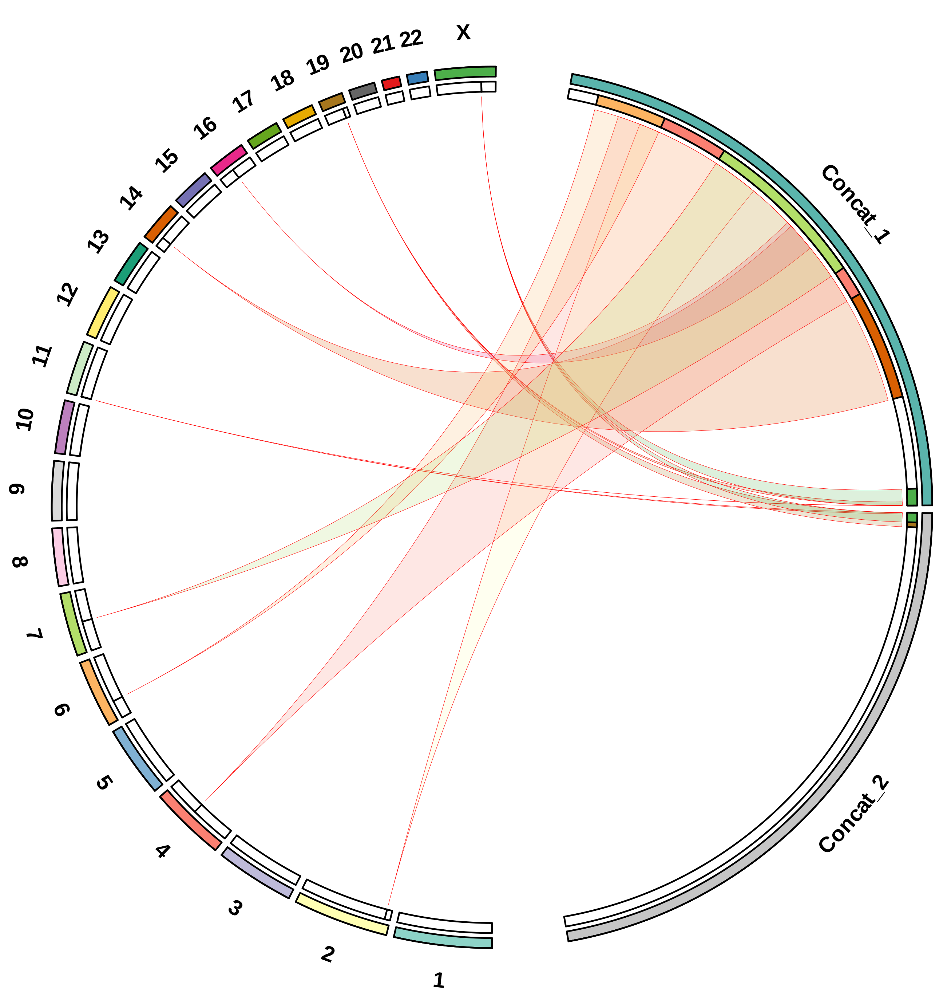

# ANOMALY

**A**nalysis of **N**uclear inserts **O**f **M**itochondri**A** using **L**ong-read sequencing in **Y**our data (**ANOMALY**) is the snakemake pipeline for calling NuMTs (Nuclear Embedded Mitochondrial Sequences) from Long-Read Sequencing data.

## Feature
- [x] Snakemake pipeline for calling NUMTs from long-read FASTQ files.
- [x] Support for Multiple Species.
- [x] Support for both ONT and PacBio Sequencing Data.
- [x] Visualisation of Called NUMTs.

## Installation
To run the Snakemake pipeline locally, the following tools and databases are required:

- [Snakemake](https://snakemake.readthedocs.io/en/stable/) >= 8.26.0
- [Minimap2](https://academic.oup.com/bioinformatics/article/34/18/3094/4994778) >= 2.28
- [SAMtools](https://pmc.ncbi.nlm.nih.gov/articles/PMC2723002/) >= 1.21
- [Sniffles](https://www.nature.com/articles/s41587-023-02024-y) >= 2.5.2
- [Seqkit](https://journals.plos.org/plosone/article?id=10.1371/journal.pone.0163962) >= 2.9.0
- [BLAST](https://www.sciencedirect.com/science/article/pii/S0022283605803602) >= 2.12.0
- [R](https://www.r-project.org/) >= 4.4.2
- MT Genome Database for BLAST

The user can install all the required tools and database using the following command:

```bash
bash setup.sh && source ~/.bashrc
```

#### NOTE: 
**1. The pipeline is tested in Ubuntu 22.04, CentOS 7 and Rocky Linux 9.5.**

**2. Only the BAM file generated by Minimap2 with the '-Y' parameter will work with the pipeline. Please use the FASTQ file in case the BAM file is not generated by Minimap2.**

**3. -Y = use soft clipping for supplementary alignments.**

**4. Supports species with at most 24 nuclear chromosomes.**

## Test Example

The pipeline can be tested using the following script:

```bash
bash run_example.sh
```
- This script will first download the raw fastq file of simulated data from human chromosome 22 with known NuMT insertions.
- It will then download the nuclear genome fasta file (CHM13), followed by Read mapping (Minimap2) and SV calling (Sniffles2).
- The insertion calls will then be mapped to the concatenated mitochondrial genome to get the putative NUMTs.
- The supplementary nuclear genome reads aligned to the mitochondrial genome will be utilised to call longer NUMTs missed by SV calling.
- The final text file will contain insertion-based and supplementary alignment-based NUMTs with overlaps removed, if any.

## Steps to follow
1. Create the Snakemake Config file:

```bash
bash get_config.sh [-d b] [-r /path/to/reference/fasta] [-m 16] [-s 16] [-p ONT] [-i /path/to/input/directory] [-o /path/to/output/directory] [-l /path/to/headers/list] [-q Minimum Mapping Quality] [-n Minimum Read Support for SV] [-g Genotype Ploidy] [-e Blast E-value Cutoff] [-c NuMT Coverage Cutoff] [-a Minimum supplementary alignments support]
-d: Specify the Input type (BAM 'b' or FASTQ 'f'). [Default: b]
-r: Absolute/Relative path of Reference Nuclear Genome FASTA file.
-m: Number of threads to be used for Minimap2. [Default: 16]
-s: Number of threads to be used for Sniffles. [Default: 16]
-p: Sequencing Platform (ONT/pb/HiFi). [Default: ONT]
-i: Absolute/Relative path of the directory that contains the FASTQ or BAM Files [Do not pass the FASTQ name].
-o: Absolute/Relative path of the directory for Pipeline Output and Intermediate Files.
-l: Absolute/Relative path of the file containing reference chromosome headers. [Default: ref_headers.txt]
-q: Minimum Map Quality for calling SVs. [default: 0]
-n: Minimum Support for calling SVs. [default: 4]
-g: Genotype Ploidy. [default: 2]
-e: Blast E-value Cutoff. [default: 1e-3]
-c: NUMT Coverage Cutoff. [default: 70]
-a: Minimum Support for calling NUMTs from Supplementary Alignments. [default: 5]

# Absolute/Relative Paths of Reference Genome, Input Data, Pipeline Output Directory, and a list with reference chromosome headers are Mandatory.
# Please note that only the BAM file generated by Minimap2 with the '-Y' parameter will work with the pipeline. Please use the FASTQ file in case the BAM file is not generated by Minimap2.
# -Y = use soft clipping for supplementary alignments.
```
   
2. Run the pipeline using SnakeMake:

```bash
conda activate snakemake
python main.py -c /path/to/working/directory/snake_config.yml
-c: Snakemake configuration YML file.
```

```bash
bash run_snakemake.sh -w /path/to/working/directory -t 96
-w: Absolute/Relative Path of the Working Directory.
-t: Maximum Number of Threads Allowed for the Snakemake Pipeline. [Default: 48]
```

## Output Table

| CHROMOSOME | POSITION | MT GENOME HEADER | MT START | MT END | LENGTH |
| :--------: | :------- | :--------------: | :------- | :----- | :----- |
| 21         | 21708210 | MT               | 5714     | 5792   | 78     |
| 9          | 129767   | MT               | 6226     | 6328   | 102    |
| 14         | 9291018  | MT               | 359      | 16337  | 591    |
| 20         | 53287942 | MT               | 407      | 16150  | 826    |
| 22         | 16645247 | MT               | 350      | 16414  | 505    |

## Output NUMT Circos Plot


The Circos plot illustrates the integration of Nuclear Mitochondrial DNA Sequences (NuMTs) across various chromosomes in the nuclear genome. The outermost circular segments represent individual chromosomes (1–22 and X) and concatenated mitochondrial genome segments (Concat_1 and Concat_2). The curved links in the inner region indicate the insertion events of NUMTs from the mitochondrial genome into nuclear chromosomes.

To visualise the NUMTs containing the control region of the mitochondrial genome, we have utilised the concatenated genome of Mitochondria (shown as Concat_1 and Concat_2). Hence, all the NUMTs containing control regions will be split into two links, one coming from the end of the first mitochondrial segment (Concat_1) and the second coming from the start of the second mitochondrial segment (Concat_2).

## Preparing the User-Specific Mitochondrial Reference Genome
#### The users can prepare their species of interest's Mitochondrial genome for the tool by using the following steps:
```bash
bash path/to/tool/Scripts/prepare_genome_fasta.sh /path/to/mitochondrial/genome/fasta && source ~/.bashrc
```
#### Things to remember:
1. The above script will save the mitochondrial genome fasta and blast database indices to the DATA directory in the tool's directory. If you move the reference genome and the indices, please make changes in the ~/.bashrc.
2. The script will also change the header of the input fasta file to "MT" to execute downstream analysis.
3. By default, the last reference genome prepared using this script will be used in the blast command. If you want to use some other reference genome, prepare the genome using the above step or make changes in the ~/.bashrc.
4. The $MT_DATA variable in the ~/.bashrc represents the path of the modified reference genome and blast indices. Please modify this variable accordingly if any changes are required.

## Pipeline Overview:


**ANOMALY Workflow:** The workflow is implemented as a Snakemake pipeline designed to detect NuMTs. It accepts raw sequencing data in FASTQ format or pre-aligned data in BAM format as input. The pipeline produces a TSV file containing NuMT calls and visual representations as a Circos plot, saved in PNG and SVG formats. In the schematic representation, the open-source tools used in the pipeline are highlighted in purple. The steps are described along the arrows connecting the workflow components. Outputs of each step are indicated within circles.

## Feedback/Help

If you have any feedback/issues, please report the issue via [GitHub](https://github.com/Nirmal2310/ANOMALY/issues).
